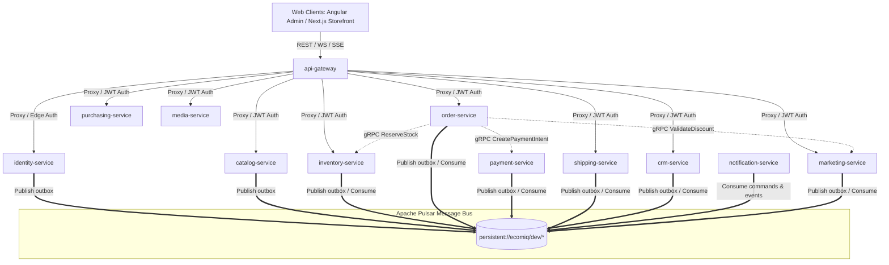
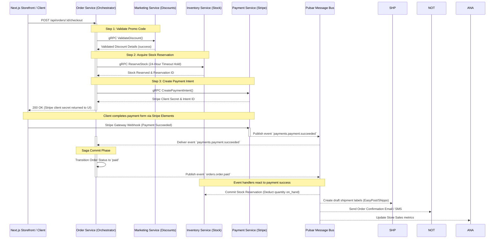

# Ecomiq — Multi-Tenant SaaS eCommerce Management Platform

Ecomiq is an enterprise-grade, multi-tenant **SaaS eCommerce management platform** (covering catalog, orders, inventory, billing, shipping, CRM, marketing campaigns, notifications, media, and AI-driven storefront workflows) designed for high performance, modular scale, and type-safe developer velocity. 

It is engineered as an **Nx Monorepo** of consolidated **NestJS microservices** communicating via a hybrid network of high-speed synchronous **gRPC** and asynchronous event-driven **Apache Pulsar** channels, backed by a **PostgreSQL** database-per-service setup.

---

## 🏗️ System Architecture

Ecomiq is built on a distributed microservices model to guarantee resilience, separate domain concerns, and support independent service deployment scaling.



---

## 🔄 Distributed Transactions: The Checkout Saga

Because Ecomiq implements a **database-per-service** model, distributed transactions (such as checkout and payment processing) cannot use regular database joins or ACID transactions. Ecomiq implements an **Orchestrated Saga Pattern** in the `order-service` to coordinate operations across multiple microservices.



### Saga Compensations (Rollback Workflow)
If any synchronous check fails (e.g. stock unavailable) or the payment intent times out after 24 hours, the orchestrator executes **compensating transactions** in reverse order to return the system to a consistent state:
1. **gRPC ReleaseStockReservation** in the `inventory-service` (stock is restored).
2. **Stripe Void/Cancel Intent** in the `payment-service` (voiding the Stripe session).
3. **Invalidate Discount Code** usage counters.
4. Transition order state to `canceled` or `failed`.

---

## 🛠️ Core Technology Stack

- **Monorepo Manager:** [Nx Workspace](https://nx.dev/) (orchestrates compilation, dependencies, and caching across apps and libs)
- **Backend Microservices:** [NestJS](https://nestjs.com/) (TypeScript, dependency injection, modular structure)
- **Database Access:** [TypeORM](https://typeorm.io/) (PostgreSQL 16, raw migration scripts, snake_case entities)
- **Message Broker:** [Apache Pulsar](https://pulsar.apache.org/) (Key_Shared message distribution, native delayed delivery)
- **Cache & Locks:** [Redis](https://redis.io/) (used for Gateway rate-limiting, distributed locks, session state, socket fanout)
- **Admin Application:** [Angular 18+](https://angular.dev/) (featuring reactive Signals-driven state management, lazy page routing)
- **Storefront Application:** [Next.js](https://nextjs.org/) (React SSR, Server Actions for mutations, [Zustand](https://github.com/pmndrs/zustand) for persistent client state, and [TanStack Query](https://tanstack.com/query) for API caching)
- **Security:** Passport.js (RS256 signed JWTs with rotating refresh keys, JWKS token verification, TOTP 2FA)

---

## 📁 Repository Directory Layout

```
├── apps/
│   ├── gateway/
│   │   └── api-gateway/            # Stateless reverse-proxy BFF edge (REST, WS, SSE, rate limit)
│   ├── services/
│   │   ├── identity/               # Zero-trust Identity, store setup, user auth, and JWT signing
│   │   ├── catalog/                # Product metadata, variant option matrices, SEO taxonomies
│   │   ├── inventory/              # Multiple warehouses, ledger-style movements, and stock rules
│   │   ├── order/                  # Orders CRUD, returns (RMA), refund decisions, Saga orchestrator
│   │   ├── payment/                # Stripe gateway integration, webhook inbox, refund executions
│   │   ├── shipping/               # EasyPost/Shippo adapters, shipment tracking timeline, label purchases
│   │   ├── purchasing/             # Suppliers, rating cards, purchase orders, receiving ledger
│   │   ├── crm/                    # Customers, loyalty scores, reviews, segments, customer auth
│   │   ├── notification/           # Email/SMS templates, dispatch retry loops, notification feeds
│   │   ├── media/                  # MinIO storage, pre-signed upload links, sharp transforms
│   │   ├── cms/                    # Store Page Builder JSONB block-tree model (Phase 3)
│   │   ├── marketing/              # Discounts engine (gRPC validator), campaign/ad scheduler
│   │   ├── analytics/              # Click heatmaps, CQRS read-model dashboard aggregations (Phase 6)
│   │   └── ai/                     # Copywriter streaming, image generators, reviews sentiment
│   └── frontend/
│       ├── admin/                  # Angular 18+ Merchant administration panel (Signals-driven)
│       ├── storefront/             # Next.js Server-Side Rendered buyer store (Zustand + TanStack)
│       └── landing/                # Angular landing page (B2B SaaS product introduction)
│
├── libs/
│   ├── contracts/                  # Versioned Protobuf files & generated gRPC typescript service stubs
│   └── shared/
│       ├── api-types/              # Shared pure TS types. Crucial contract layer preventing Type-Drift
│       ├── auth/                   # Shared Passport Guards (JwtAuthGuard, StoreContextGuard, permissions)
│       ├── pulsar/                 # Custom shared event-producer, consumer, and transactional outbox
│       └── typeorm/                # Shared TypeORM baseline config, snake_case mapping, outbox entities
```

---

## 🔒 Advanced Architectural Patterns

### 1. Transactional Outbox Pattern
To prevent the "dual-write" problem (where a microservice updates its SQL database but fails to publish the corresponding event to the Apache Pulsar broker), Ecomiq uses a **Transactional Outbox**.
Every database transaction writes the updated entity *and* an event record into an `outbox` table in the *same PostgreSQL transaction*. A dedicated background outbox relay runner polls the `outbox` table, publishes the message to Pulsar, and flags it as processed. This guarantees **at-least-once delivery** of all domain events.

### 2. Pulsar Key_Shared Subscription Ordering
In a distributed microservice setup with multiple consumer pods, processing events concurrently can lead to race conditions. By setting the Pulsar message **routing key** to the aggregate identifier (e.g., `orderId`, `productId`, or `supplierId`) and subscribing with a `Key_Shared` subscription model, Pulsar guarantees that all events with the same key are routed to the **same consumer instance sequentially**, while maintaining parallel delivery across distinct keys.

### 3. Shared contract libraries preventing Type-Drift
Frontend-backend client mismatches are prevented using monorepo type sharing:
- **gRPC schemas** are declared as Protobuf v3 files in [libs/contracts](file:///Users/napster/Projects/Ecomiq/libs/contracts) and compiled to TypeScript interfaces using `npm run contracts:gen`.
- **REST structures** are declared as shared TypeScript models in [libs/shared/api-types](file:///Users/napster/Projects/Ecomiq/libs/shared/api-types).
- Both frontend apps (Next.js, Angular) and backend services import these shared packages. If the backend schema changes, compile-time type checks fail on the frontend immediately, preventing runtime crashes.

---

## 🚀 Getting Started

### 📋 Prerequisites
- **Node.js** v20+
- **Docker Desktop**
- **protoc** (Protocol Buffers compiler - required to compile gRPC contracts)
  ```bash
  # macOS
  brew install protobuf
  ```

### ⚙️ Quick Start (Development Setup)

1. **Install dependencies:**
   ```bash
   npm install
   ```

2. **Generate gRPC typescript types:**
   ```bash
   npm run contracts:gen
   ```

3. **Spin up backing infrastructure (PostgreSQL, Redis, Pulsar, MinIO):**
   ```bash
   docker compose up -d
   ```

4. **Provision Pulsar namespaces and topics:**
   ```bash
   npm run pulsar:provision
   ```

5. **Generate JWT signing keys (RS256):**
   ```bash
   npm run identity:keys:generate
   npm run crm:keys:generate
   npm run purchasing:keys:generate
   ```

6. **Seed services databases:**
   ```bash
   npm run identity:service-accounts:seed
   npm run catalog:seed
   npm run inventory:seed
   npm run crm:seed
   npm run purchasing:seed
   npm run notification:seed
   npm run media:seed
   npm run payment:seed
   npm run marketing:seed
   npm run order:seed
   npm run shipping:seed
   ```

7. **Run microservices in development mode:**
   ```bash
   # Launch individual services via Nx
   npx nx serve api-gateway
   npx nx nx serve identity-service
   # ...
   ```

---

## 🧪 Testing and Verification

To verify typings and run unit/integration suites locally:

### 1. Static Compilation Checks
Verify that all services compile cleanly without type issues:
```bash
# Example
npx tsc -p apps/services/order/tsconfig.app.json --noEmit
```

### 2. Run Test Suites
Execute repository-wide tests managed by Jest:
```bash
npx jest
```

For detailed scenario test guides (including how to run webhook simulation scripts, rollback scenarios, stock reservation expiry scenarios, etc.), see the dedicated [TESTING.md](file:///Users/napster/Projects/Ecomiq/TESTING.md) playbook.
